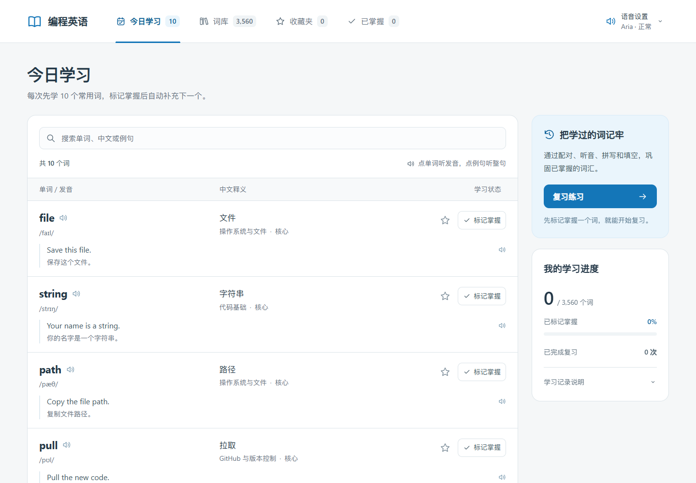
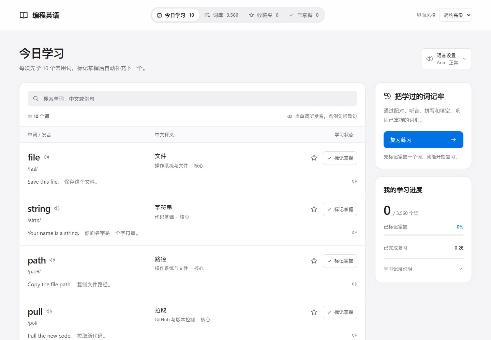
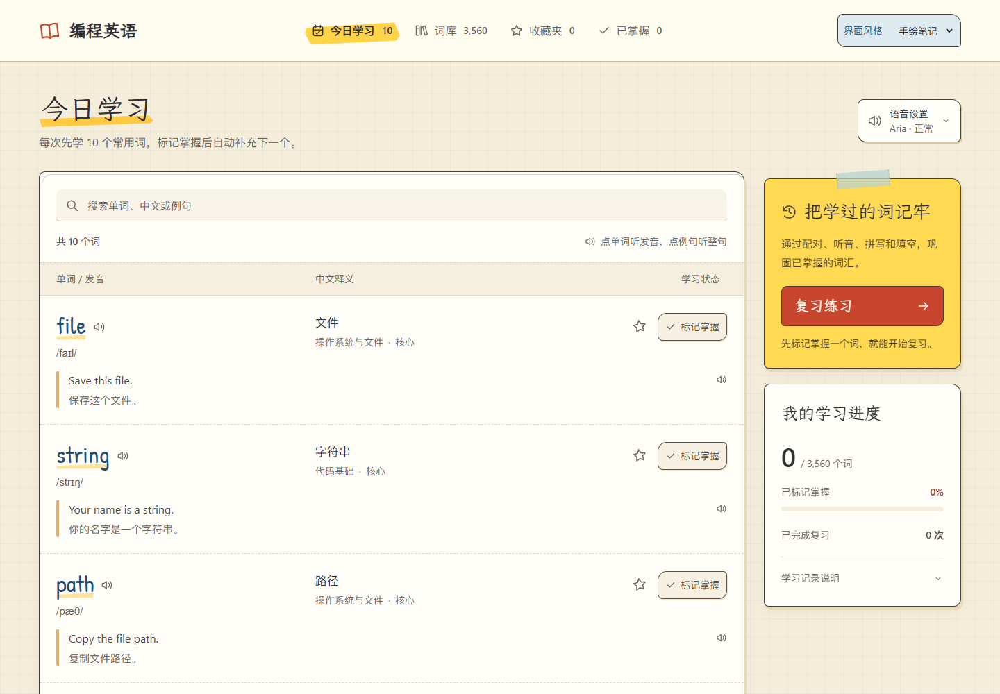
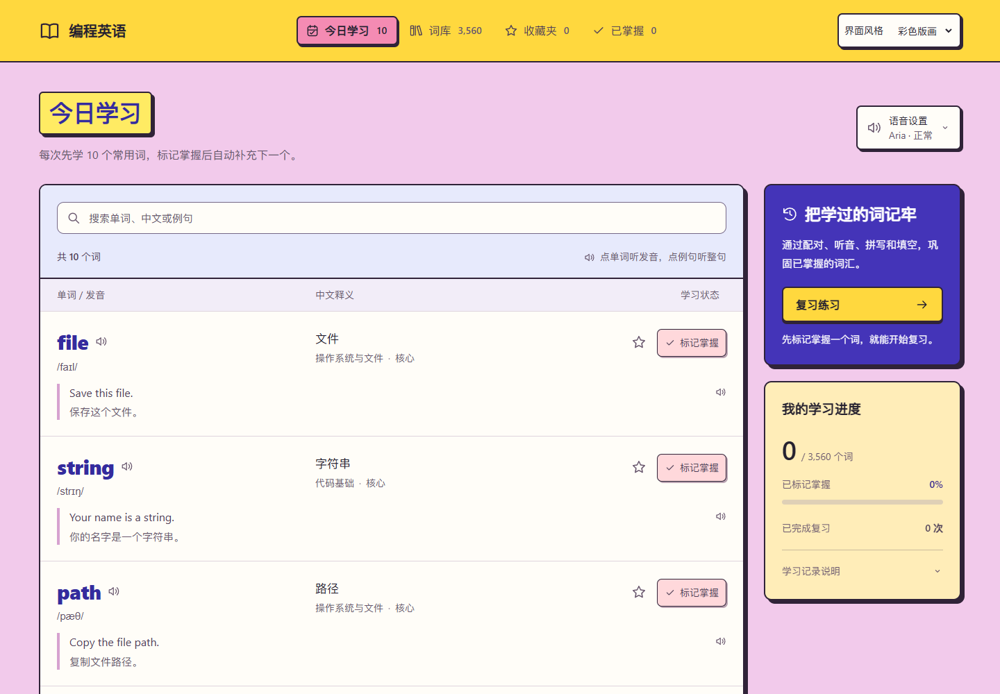
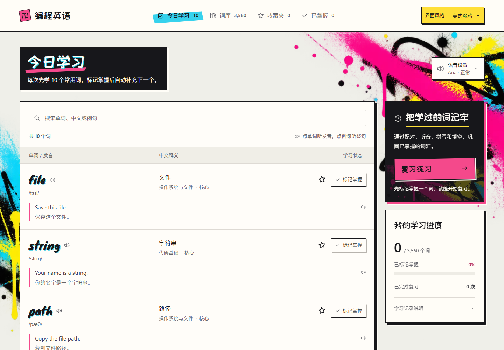

# 四风格改版验收

2026-09-15。在现有 React / Vite 项目中接入四种已确认风格，使用完整词库和现有学习组件，未用参考页的四词示例替换正式网站。

## 使用

本地地址仍为 `http://localhost:5186/`。右上角“界面风格”可选择简约高级、手绘笔记、彩色版画、美式涂鸦。默认简约高级；用户选择写入独立的 `codewords-theme`，刷新后恢复。

全屏复习同样提供风格选择。切换时保留题目、答案、反馈、练习进度；词汇页的搜索、分类、级别和已加载词条也保持原状。既有导航切换时清除筛选的规则保持不变。

四种导航分别使用胶囊滑动、荧光笔扫入、印章回弹和喷漆展开；内容同步切换，连续点击取消旧动画。系统开启“减少动态效果”后停止这些位移动画。音频反馈继续由真实媒体事件驱动。

## 保留的正式功能

- 全部 3,560 个词汇及中文释义、分类、级别、音标、中英例句；今日学习的补词规则、分类/级别/搜索和分页加载。
- 单词、词条空白区域和例句点读，Aria / Guy、正常 / 慢速、试听及偏好记忆。
- 收藏、掌握、重新学习、导航真实数量、学习进度、已完成复习次数。
- 词义选择、单词配对、听音选词、渐进听写、句子选词填空；提示、暂时不会、即时纠错、后续变式复查及结果总结。
- 听写连续输入、自动跳格、左右键、退格/Delete、Tab、输入法确认、Enter 检查/继续。
- 原有学习存储键、记录合并、损坏存储保护和练习规则。

此前已按用户要求移除的“拼写拆解”继续不显示。学习所用拼写、听写和纠错仍然保留。

`src/vocabulary.ts`、`src/review.ts`、`src/lesson.ts`、`src/LessonExercise.tsx`、原 `src/lesson.css`、`vite.config.ts` 与开工前 SHA-256 一致。核对记录在 [protected-source-check.json](../artifacts/theme-rollout/protected-source-check.json)。用户原有未提交词库、例句、音频及其他修改均保留；本轮没有重新生成词汇或录音。

## 验证结果

| 检查 | 结果 |
| --- | --- |
| `npx tsc --noEmit` | 通过 |
| `npm run build` | 通过；静态部署成品 14,258 个文件，保留两套完整现用声音 |
| `npm run verify` | 通过；3,560 词、Aria/Guy 各 7,121 MP3、旧 Piper 7,122 MP3，无缺失或空音频 |
| 现有纯函数和组件静态测试 | 60 项通过 |
| `tools/test-review-browser.mjs` | 12 场景通过，覆盖全部题型、帮助、错误复查、记录保护、退出和手机长词 |
| `tools/test-dictation-keyboard.mjs` | 8 场景通过，包括真实 Chrome 输入法输入 |
| `tools/test-redesign-browser.mjs` | 7 场景通过，含 16 次实际媒体播放核验、刷新后记录、五题型完整轮次和后续纠错 |
| `tools/test-themes-browser.mjs` | 四主题的记录/筛选/分页保留、导航实动效、快速点击、减少动态效果及练习切换检查通过 |
| 生产成品冒烟 | 从同端口 `/dist/` 加载生产 JS；四套字体、涂鸦图片、Guy 慢速点读正常，主题 CSS 资源路径已变为相对路径 |

四主题检查了 1440、1920、1024、820、600、390、320px；练习额外检查 1440、1920、390、320px。无水平溢出。浏览器回归均使用独立临时上下文，不操作用户浏览器中的学习记录。

构建仍提示主 JS 大于 500 KB；本轮未更换技术栈或引入 UI 框架。主包包含现有完整词库。新增字体约 173 KB、涂鸦 WebP 374 KB，均随静态文件部署，运行时不依赖外部字体服务。字体许可证及来源在 `public/themes/fonts/`。

练习回归报告有已单独忽略的 favicon 请求错误；无相关功能失败。未发布、提交或推送。

## 前后截图

截图来自真实项目的独立测试上下文，页面中的数量是该上下文的实际状态。完整证据目录为 [artifacts/theme-rollout](../artifacts/theme-rollout/)。

| 页面 | 改版前 | 改版后 |
| --- | --- | --- |
| 今日学习，1440px | [原界面](../artifacts/theme-rollout/before-today-1440.png) | [简约高级](../artifacts/theme-rollout/themes/minimal-today-1440.png) · [手绘笔记](../artifacts/theme-rollout/themes/sketch-today-1440.png) · [彩色版画](../artifacts/theme-rollout/themes/print-today-1440.png) · [美式涂鸦](../artifacts/theme-rollout/themes/graffiti-today-1440.png) |
| 今日学习，1920px | [原界面](../artifacts/theme-rollout/before-today-1920.png) | [简约高级](../artifacts/theme-rollout/themes/minimal-today-1920.png) · [手绘笔记](../artifacts/theme-rollout/themes/sketch-today-1920.png) · [彩色版画](../artifacts/theme-rollout/themes/print-today-1920.png) · [美式涂鸦](../artifacts/theme-rollout/themes/graffiti-today-1920.png) |
| 词库与分类筛选 | [原界面](../artifacts/theme-rollout/before-library-1440.png) | [真实词库](../artifacts/theme-rollout/regression/library-1440.png) |
| 语音设置 | [原界面](../artifacts/theme-rollout/before-settings-1440.png) | [简约高级](../artifacts/theme-rollout/themes/minimal-settings-1440.png) · [手绘笔记](../artifacts/theme-rollout/themes/sketch-settings-1440.png) · [彩色版画](../artifacts/theme-rollout/themes/print-settings-1440.png) · [美式涂鸦](../artifacts/theme-rollout/themes/graffiti-settings-1440.png) |
| 复习练习 | [原界面](../artifacts/theme-rollout/before-practice-1440.png) | [简约高级](../artifacts/theme-rollout/themes/minimal-practice-1440.png) · [手绘笔记](../artifacts/theme-rollout/themes/sketch-practice-1440.png) · [彩色版画](../artifacts/theme-rollout/themes/print-practice-1440.png) · [美式涂鸦](../artifacts/theme-rollout/themes/graffiti-practice-1440.png) |

补充：[错误反馈](../artifacts/theme-rollout/regression/feedback-error-1440.png) · [结果总结](../artifacts/theme-rollout/regression/practice-summary-1440.png) · [320px 练习](../artifacts/theme-rollout/themes/graffiti-practice-320.png)。

### 今日学习：改版前

### 今日学习：四种已确认风格

